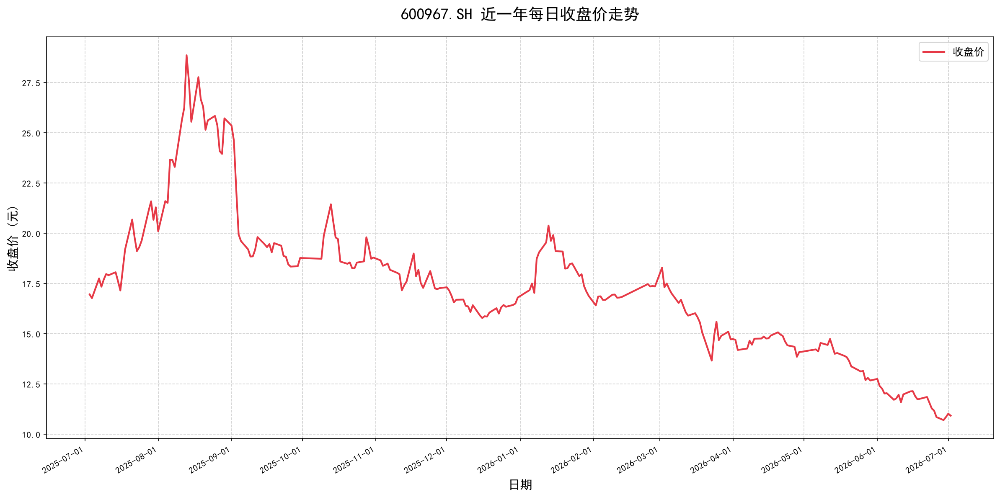

# 600967.SH 近一年交易数据分析报告

**数据区间**：2025年07月03日 — 2026年07月02日 
**交易日**：242天 
**报告生成**：2026年07月03日

## 一、数据概览

| 指标 | 数值 |
|------|------|
| 区间涨跌幅 | -35.61% |
| 期间最高价 | 30.68元 |
| 期间最低价 | 10.50元 |
| 期初收盘价 | 16.96元 |
| 期末收盘价 | 10.92元 |
| 日均成交量 | 538647手 |
| 上涨天数 | 115天 |
| 下跌天数 | 124天 |
| 平盘天数 | 3天 |
| 上涨天数占比 | 47.5% |

## 二、每日收盘价走势图

## 三、数据分析

### 3.1 价格走势分析

近一年来，600967.SH股价从16.96元下跌至10.92元，跌幅达35.61%。期间最高价30.68元，最低价10.50元，振幅较大。

### 3.2 市场表现

上涨天数占比47.5%，显示市场偏弱。日均成交量538647手，交投。

## 四、总结

600967.SH近一年整体表现不佳，受市场环境和公司基本面影响，股价承压。投资者可结合更多指标进行综合分析。

---

**数据来源**：Tushare Pro API  
**分析工具**：Python + Pandas + Matplotlib
